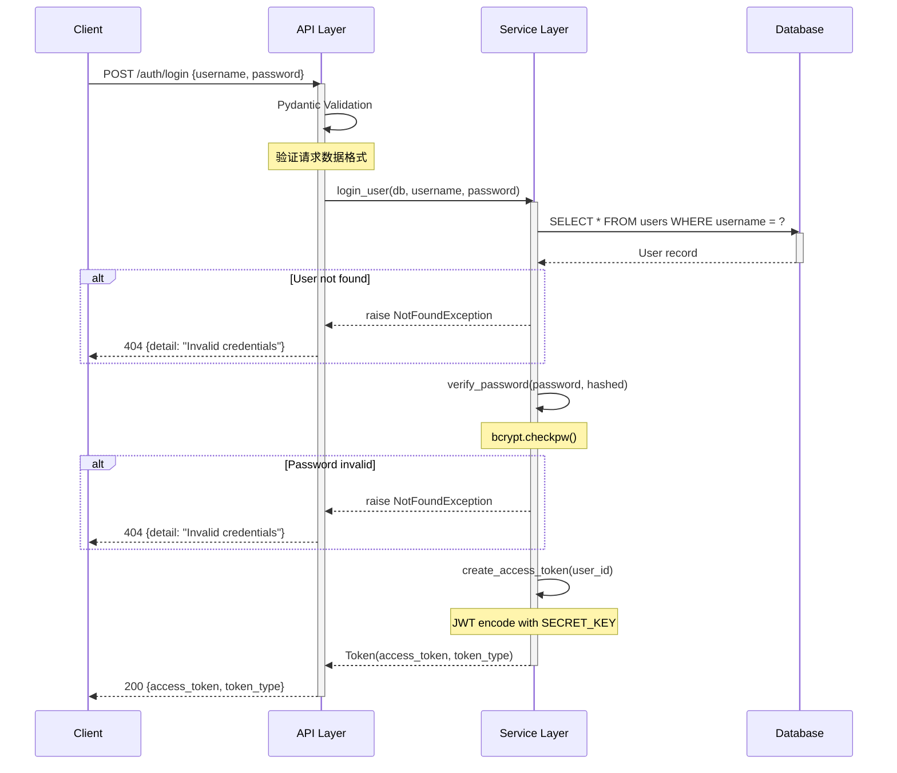
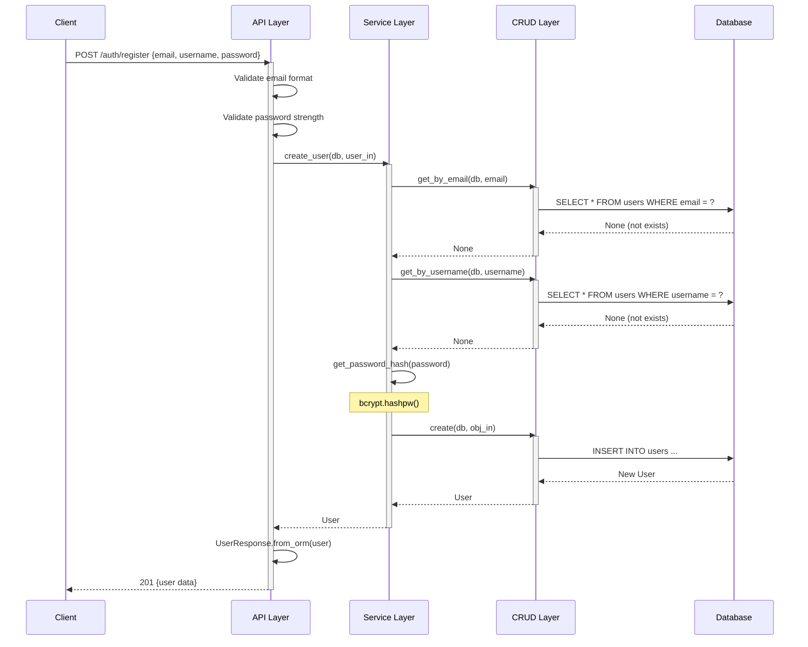
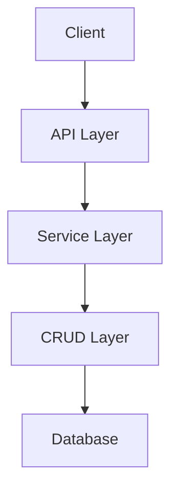

# 架构图与流程图

> 本文档包含项目的可视化架构图、流程图和数据流图。

## 目录

1. [系统架构图](#系统架构图)
2. [部署架构图](#部署架构图)
3. [数据流图](#数据流图)
4. [时序图](#时序图)
5. [类图](#类图)
6. [数据库关系图](#数据库关系图)
7. [状态图](#状态图)

---

## 系统架构图

### 整体架构

```
┌─────────────────────────────────────────────────────────────────────────────────┐
│                              客户端 (Clients)                                    │
│    ┌─────────────┐  ┌─────────────┐  ┌─────────────┐  ┌─────────────┐          │
│    │ Web Browser │  │ Mobile App  │  │   Postman   │  │  Third-party│          │
│    └──────┬──────┘  └──────┬──────┘  └──────┬──────┘  └──────┬──────┘          │
│           │                │                │                │                  │
└───────────┼────────────────┼────────────────┼────────────────┼──────────────────┘
            │                │                │                │
            └────────────────┴────────┬───────┴────────────────┘
                                      │
                                      ▼
┌─────────────────────────────────────────────────────────────────────────────────┐
│                           负载均衡层 (Load Balancer)                             │
│                        Nginx / AWS ALB / Cloudflare                              │
└─────────────────────────────────────┬───────────────────────────────────────────┘
                                      │ HTTPS
                                      ▼
┌─────────────────────────────────────────────────────────────────────────────────┐
│                              API 网关层                                          │
│    ┌──────────────────────────────────────────────────────────────────────┐     │
│    │  • CORS 处理    • 认证验证    • 请求限流    • 日志记录               │     │
│    └──────────────────────────────────────────────────────────────────────┘     │
└─────────────────────────────────────┬───────────────────────────────────────────┘
                                      │
                                      ▼
┌─────────────────────────────────────────────────────────────────────────────────┐
│                          应用服务层 (FastAPI Application)                        │
│  ┌─────────────────────────────────────────────────────────────────────────┐   │
│  │                            API Layer (app/api/)                          │   │
│  │   ┌─────────────┐  ┌─────────────┐  ┌─────────────┐  ┌─────────────┐   │   │
│  │   │   auth.py   │  │  users.py   │  │  fte.py     │  │  ...更多    │   │   │
│  │   └─────────────┘  └─────────────┘  └─────────────┘  └─────────────┘   │   │
│  └─────────────────────────────────────────────────────────────────────────┘   │
│                                      │                                          │
│                                      ▼                                          │
│  ┌─────────────────────────────────────────────────────────────────────────┐   │
│  │                         Service Layer (app/services/)                    │   │
│  │   ┌─────────────────┐  ┌─────────────────┐  ┌─────────────────┐        │   │
│  │   │  UserService    │  │  FTEService     │  │  DataImport     │        │   │
│  │   │  • 业务逻辑     │  │  • FTE计算      │  │  • 数据导入     │        │   │
│  │   │  • 事务协调     │  │  • 多步骤编排   │  │  • 数据验证     │        │   │
│  │   └─────────────────┘  └─────────────────┘  └─────────────────┘        │   │
│  └─────────────────────────────────────────────────────────────────────────┘   │
│                                      │                                          │
│                                      ▼                                          │
│  ┌─────────────────────────────────────────────────────────────────────────┐   │
│  │                          CRUD Layer (app/crud/)                          │   │
│  │   ┌─────────────────┐  ┌─────────────────┐  ┌─────────────────┐        │   │
│  │   │    CRUDUser     │  │   CRUDOrder     │  │   CRUDProduct   │        │   │
│  │   │   继承CRUDBase  │  │   继承CRUDBase  │  │   继承CRUDBase  │        │   │
│  │   └─────────────────┘  └─────────────────┘  └─────────────────┘        │   │
│  └─────────────────────────────────────────────────────────────────────────┘   │
└─────────────────────────────────────┬───────────────────────────────────────────┘
                                      │
                                      ▼
┌─────────────────────────────────────────────────────────────────────────────────┐
│                           数据库连接层 (Database Connections)                    │
│    ┌─────────────────┐     ┌─────────────────┐     ┌─────────────────┐         │
│    │  UserSession    │     │ BusinessSession │     │  ConfigSession  │         │
│    │    Local        │     │     Local       │     │     Local       │         │
│    └────────┬────────┘     └────────┬────────┘     └────────┬────────┘         │
│             │                       │                       │                   │
└─────────────┼───────────────────────┼───────────────────────┼───────────────────┘
              │                       │                       │
              ▼                       ▼                       ▼
┌─────────────────────┐ ┌─────────────────────┐ ┌─────────────────────┐
│   PostgreSQL        │ │    SQL Server       │ │       MySQL         │
│   (User DB)         │ │   (Business DB)     │ │    (Config DB)      │
│                     │ │                     │ │                     │
│  • users            │ │  • orders           │ │  • system_config    │
│  • roles            │ │  • order_items      │ │  • data_dictionary  │
│  • permissions      │ │  • products         │ │  (未来扩展)         │
│  • user_roles       │ │                     │ │                     │
│  • role_permissions │ │                     │ │                     │
└─────────────────────┘ └─────────────────────┘ └─────────────────────┘
        Read/Write              Read/Write              Read Only
```

### 分层架构详图

```
┌─────────────────────────────────────────────────────────────────────────────────┐
│                              表现层 (Presentation Layer)                          │
│  ┌─────────────────────────────────────────────────────────────────────────┐   │
│  │                           API Endpoints                                  │   │
│  │  ┌────────────────────────────────────────────────────────────────┐     │   │
│  │  │  输入验证 (Pydantic)  │  路由分发  │  响应序列化  │  依赖注入  │     │   │
│  │  └────────────────────────────────────────────────────────────────┘     │   │
│  │                                                                         │   │
│  │  职责: 处理 HTTP 请求/响应，不包含业务逻辑                               │   │
│  └─────────────────────────────────────────────────────────────────────────┘   │
└─────────────────────────────────────────────────────────────────────────────────┘
                                      │
                                      ▼
┌─────────────────────────────────────────────────────────────────────────────────┐
│                              业务层 (Business Layer)                             │
│  ┌─────────────────────────────────────────────────────────────────────────┐   │
│  │                           Service Classes                                │   │
│  │  ┌────────────────────────────────────────────────────────────────┐     │   │
│  │  │  业务规则验证  │  事务管理  │  异常处理  │  数据转换  │  日志  │     │   │
│  │  └────────────────────────────────────────────────────────────────┘     │   │
│  │                                                                         │   │
│  │  职责: 核心业务逻辑，协调多个数据源，抛出业务异常                         │   │
│  └─────────────────────────────────────────────────────────────────────────┘   │
└─────────────────────────────────────────────────────────────────────────────────┘
                                      │
                                      ▼
┌─────────────────────────────────────────────────────────────────────────────────┐
│                            数据访问层 (Data Access Layer)                        │
│  ┌─────────────────────────────────────────────────────────────────────────┐   │
│  │                           CRUD Classes                                   │   │
│  │  ┌────────────────────────────────────────────────────────────────┐     │   │
│  │  │  SELECT  │  INSERT  │  UPDATE  │  DELETE  │  JOIN  │  聚合   │     │   │
│  │  └────────────────────────────────────────────────────────────────┘     │   │
│  │                                                                         │   │
│  │  职责: 封装数据库操作，提供通用 CRUD 方法                                 │   │
│  └─────────────────────────────────────────────────────────────────────────┘   │
└─────────────────────────────────────────────────────────────────────────────────┘
                                      │
                                      ▼
┌─────────────────────────────────────────────────────────────────────────────────┐
│                              数据模型层 (Model Layer)                            │
│  ┌─────────────────────────────────────────────────────────────────────────┐   │
│  │                         SQLAlchemy Models                                │   │
│  │  ┌────────────────────────────────────────────────────────────────┐     │   │
│  │  │  表定义  │  字段类型  │  约束  │  索引  │  关系  │  触发器   │     │   │
│  │  └────────────────────────────────────────────────────────────────┘     │   │
│  │                                                                         │   │
│  │  职责: 定义数据结构，映射数据库表                                         │   │
│  └─────────────────────────────────────────────────────────────────────────┘   │
└─────────────────────────────────────────────────────────────────────────────────┘
```

---

## 部署架构图

### 开发环境

```
┌─────────────────────────────────────────────────────────────────────────────────┐
│                          开发环境 (Development)                                  │
│                                                                                  │
│    Developer Machine                                                            │
│    ┌─────────────────────────────────────────────────────────────────────┐      │
│    │                                                                      │      │
│    │   ┌──────────────────┐    ┌──────────────────┐                      │      │
│    │   │  VS Code / IDE   │    │   Terminal       │                      │      │
│    │   │  • 代码编辑       │    │   • uvicorn      │                      │      │
│    │   │  • 调试           │    │   • pytest       │                      │      │
│    │   │  • Git            │    │   • alembic      │                      │      │
│    │   └────────┬─────────┘    └────────┬─────────┘                      │      │
│    │            │                       │                                │      │
│    │            └───────────┬───────────┘                                │      │
│    │                        │                                            │      │
│    │                        ▼                                            │      │
│    │            ┌──────────────────────┐                                 │      │
│    │            │   FastAPI App        │                                 │      │
│    │            │   localhost:8000     │                                 │      │
│    │            └──────────┬───────────┘                                 │      │
│    │                       │                                             │      │
│    └───────────────────────┼─────────────────────────────────────────────┘      │
│                            │                                                    │
│    ┌───────────────────────┼──────────────────────────────────────────────┐    │
│    │                       ▼                                              │    │
│    │   ┌───────────────────────┐  ┌───────────────────────┐              │    │
│    │   │   Docker Containers   │  │   Local .venv         │              │    │
│    │   │                       │  │                       │              │    │
│    │   │   ┌───────────────┐   │  │   ┌───────────────┐   │              │    │
│    │   │   │  PostgreSQL   │   │  │   │   Python 3.13 │   │              │    │
│    │   │   │  :5432        │   │  │   │   FastAPI     │   │              │    │
│    │   │   └───────────────┘   │  │   │   SQLAlchemy  │   │              │    │
│    │   │   ┌───────────────┐   │  │   │   ...         │   │              │    │
│    │   │   │  SQL Server   │   │  │   └───────────────┘   │              │    │
│    │   │   │  :1433        │   │  │                       │              │    │
│    │   │   └───────────────┘   │  └───────────────────────┘              │    │
│    │   │   ┌───────────────┐   │                                         │    │
│    │   │   │    MySQL      │   │                                         │    │
│    │   │   │  :3306        │   │                                         │    │
│    │   │   └───────────────┘   │                                         │    │
│    │   └───────────────────────┘                                         │    │
│    └──────────────────────────────────────────────────────────────────────┘    │
└─────────────────────────────────────────────────────────────────────────────────┘
```

### 生产环境

```
┌─────────────────────────────────────────────────────────────────────────────────┐
│                          生产环境 (Production)                                   │
│                                                                                  │
│   ┌─────────────────────────────────────────────────────────────────────────┐   │
│   │                          CDN / Cloudflare                               │   │
│   │                    (静态资源缓存, DDoS 防护)                            │   │
│   └───────────────────────────────────┬─────────────────────────────────────┘   │
│                                       │                                         │
│                                       ▼                                         │
│   ┌─────────────────────────────────────────────────────────────────────────┐   │
│   │                      Load Balancer (AWS ALB/Nginx)                      │   │
│   │                    (SSL 终止, 健康检查, 路由规则)                        │   │
│   └───────────────────────────────────┬─────────────────────────────────────┘   │
│                                       │                                         │
│           ┌───────────────────────────┼───────────────────────────┐             │
│           │                           │                           │             │
│           ▼                           ▼                           ▼             │
│   ┌───────────────┐         ┌───────────────┐         ┌───────────────┐        │
│   │   App #1      │         │   App #2      │         │   App #3      │        │
│   │  (Gunicorn    │         │  (Gunicorn    │         │  (Gunicorn    │        │
│   │   + Uvicorn)  │         │   + Uvicorn)  │         │   + Uvicorn)  │        │
│   │               │         │               │         │               │        │
│   │  Port: 8000   │         │  Port: 8000   │         │  Port: 8000   │        │
│   └───────┬───────┘         └───────┬───────┘         └───────┬───────┘        │
│           │                         │                         │                 │
│           └─────────────────────────┼─────────────────────────┘                 │
│                                     │                                           │
│   ┌─────────────────────────────────┼─────────────────────────────────────┐    │
│   │                                 │                                     │    │
│   │                                 ▼                                     │    │
│   │  ┌───────────────────────────────────────────────────────────────┐   │    │
│   │  │                    Internal Service Mesh                      │   │    │
│   │  │                  (服务发现, 配置中心, 日志)                    │   │    │
│   │  └───────────────────────────────────────────────────────────────┘   │    │
│   │                                 │                                     │    │
│   │         ┌───────────────────────┼───────────────────────┐             │    │
│   │         │                       │                       │             │    │
│   │         ▼                       ▼                       ▼             │    │
│   │ ┌─────────────────┐   ┌─────────────────┐   ┌─────────────────┐      │    │
│   │ │   PostgreSQL    │   │   SQL Server    │   │     MySQL       │      │    │
│   │ │   Primary +     │   │   Primary +     │   │   (Read Only)   │      │    │
│   │ │   Replica       │   │   Replica       │   │                 │      │    │
│   │ │                 │   │                 │   │                 │      │    │
│   │ │  RDS / 自建     │   │  RDS / 自建     │   │  RDS / 自建     │      │    │
│   │ │  自动备份       │   │  自动备份       │   │  定期备份       │      │    │
│   │ └─────────────────┘   └─────────────────┘   └─────────────────┘      │    │
│   │                                                                       │    │
│   └───────────────────────────────────────────────────────────────────────┘    │
│                                                                                  │
│   ┌─────────────────────────────────────────────────────────────────────────┐   │
│   │                         监控与日志                                        │   │
│   │   ┌─────────────┐  ┌─────────────┐  ┌─────────────┐  ┌─────────────┐   │   │
│   │   │ Prometheus  │  │  Grafana    │  │   ELK/EFK   │  │   Sentry    │   │   │
│   │   │ (指标收集)  │  │ (可视化)    │  │  (日志)     │  │ (错误追踪)  │   │   │
│   │   └─────────────┘  └─────────────┘  └─────────────┘  └─────────────┘   │   │
│   └─────────────────────────────────────────────────────────────────────────┘   │
└─────────────────────────────────────────────────────────────────────────────────┘
```

---

## 数据流图

### 用户注册数据流

```
┌─────────────────────────────────────────────────────────────────────────────────┐
│                            用户注册数据流                                        │
└─────────────────────────────────────────────────────────────────────────────────┘

  Client                  API Layer                Service Layer           Database
    │                         │                          │                      │
    │  POST /auth/register    │                          │                      │
    │  {email, username,      │                          │                      │
    │   password}             │                          │                      │
    │────────────────────────>│                          │                      │
    │                         │                          │                      │
    │                         │  Pydantic Validation     │                      │
    │                         │  • Email format          │                      │
    │                         │  • Password strength     │                      │
    │                         │  ✓ 验证通过              │                      │
    │                         │                          │                      │
    │                         │  Depends(get_user_db)    │                      │
    │                         │─────────────────────────>│                      │
    │                         │                          │                      │
    │                         │                          │  Check email unique  │
    │                         │                          │─────────────────────>│
    │                         │                          │                      │
    │                         │                          │  ✓ Email available   │
    │                         │                          │<─────────────────────│
    │                         │                          │                      │
    │                         │                          │  Check username      │
    │                         │                          │  unique              │
    │                         │                          │─────────────────────>│
    │                         │                          │                      │
    │                         │                          │  ✓ Username          │
    │                         │                          │  available           │
    │                         │                          │<─────────────────────│
    │                         │                          │                      │
    │                         │                          │  Hash password       │
    │                         │                          │  (bcrypt)            │
    │                         │                          │  ┌────────────────┐  │
    │                         │                          │  │ password123    │  │
    │                         │                          │  │      ↓         │  │
    │                         │                          │  │ $2b$12$xY...   │  │
    │                         │                          │  └────────────────┘  │
    │                         │                          │                      │
    │                         │                          │  INSERT user         │
    │                         │                          │─────────────────────>│
    │                         │                          │                      │
    │                         │                          │  ✓ User created      │
    │                         │                          │  (with id, timestamps)│
    │                         │                          │<─────────────────────│
    │                         │                          │                      │
    │                         │  UserResponse schema     │                      │
    │                         │  (exclude password)      │                      │
    │                         │<─────────────────────────│                      │
    │                         │                          │                      │
    │  201 Created            │                          │                      │
    │  {id, email, username,  │                          │                      │
    │   is_active, created_at}│                          │                      │
    │<────────────────────────│                          │                      │
    │                         │                          │                      │
```

### JWT 认证数据流

```
┌─────────────────────────────────────────────────────────────────────────────────┐
│                            JWT 认证数据流                                        │
└─────────────────────────────────────────────────────────────────────────────────┘

  Client                  API Layer                Service Layer           Database
    │                         │                          │                      │
    │  POST /auth/login       │                          │                      │
    │  {username, password}   │                          │                      │
    │────────────────────────>│                          │                      │
    │                         │                          │                      │
    │                         │  Pydantic Validation     │                      │
    │                         │  ✓ 验证通过              │                      │
    │                         │                          │                      │
    │                         │                          │  Find user by        │
    │                         │                          │  username            │
    │                         │                          │─────────────────────>│
    │                         │                          │                      │
    │                         │                          │  User record         │
    │                         │                          │<─────────────────────│
    │                         │                          │                      │
    │                         │                          │  ┌────────────────┐  │
    │                         │                          │  │Verify password │  │
    │                         │                          │  │                │  │
    │                         │                          │  │ input: pass123 │  │
    │                         │                          │  │ stored: $2b$.. │  │
    │                         │                          │  │      ↓         │  │
    │                         │                          │  │ ✓ Match!       │  │
    │                         │                          │  └────────────────┘  │
    │                         │                          │                      │
    │                         │                          │  Create JWT Token    │
    │                         │                          │  ┌────────────────┐  │
    │                         │                          │  │ Header:        │  │
    │                         │                          │  │ {alg: HS256}   │  │
    │                         │                          │  │ Payload:       │  │
    │                         │                          │  │ {sub: "1",     │  │
    │                         │                          │  │  exp: 123...}  │  │
    │                         │                          │  │ Signature:     │  │
    │                         │                          │  │ HMAC-SHA256    │  │
    │                         │                          │  └────────────────┘  │
    │                         │                          │                      │
    │                         │  Token response          │                      │
    │                         │<─────────────────────────│                      │
    │                         │                          │                      │
    │  200 OK                 │                          │                      │
    │  {access_token,         │                          │                      │
    │   token_type: bearer}   │                          │                      │
    │<────────────────────────│                          │                      │
    │                         │                          │                      │
    │  ═══════════════════════════════════════════════════════════════════════  │
    │                         │                          │                      │
    │  GET /users/me          │                          │                      │
    │  Authorization:         │                          │                      │
    │  Bearer <token>         │                          │                      │
    │────────────────────────>│                          │                      │
    │                         │                          │                      │
    │                         │  Extract token from      │                      │
    │                         │  Authorization header    │                      │
    │                         │                          │                      │
    │                         │  ┌────────────────┐      │                      │
    │                         │  │ Verify JWT     │      │                      │
    │                         │  │ • Check sig    │      │                      │
    │                         │  │ • Check expiry │      │                      │
    │                         │  │ ✓ Valid!       │      │                      │
    │                         │  │ user_id: 1     │      │                      │
    │                         │  └────────────────┘      │                      │
    │                         │                          │                      │
    │                         │                          │  Get user by ID      │
    │                         │                          │─────────────────────>│
    │                         │                          │                      │
    │                         │                          │  User record         │
    │                         │                          │<─────────────────────│
    │                         │                          │                      │
    │                         │                          │  Check is_active     │
    │                         │                          │  ✓ Active            │
    │                         │                          │                      │
    │                         │  Current user            │                      │
    │                         │<─────────────────────────│                      │
    │                         │                          │                      │
    │  200 OK                 │                          │                      │
    │  {user info}            │                          │                      │
    │<────────────────────────│                          │                      │
```

---

## 时序图

### 登录流程时序图



### 创建用户时序图



---

## 类图

### CRUD 层类图

```
┌─────────────────────────────────────────────────────────────────────────────────┐
│                              CRUD Layer 类关系图                                  │
└─────────────────────────────────────────────────────────────────────────────────┘

                    ┌─────────────────────────────────────┐
                    │           CRUDBase                   │
                    │  [Generic[ModelType, CreateSchema,  │
                    │          UpdateSchema]]              │
                    ├─────────────────────────────────────┤
                    │ - model: Type[ModelType]             │
                    ├─────────────────────────────────────┤
                    │ + get(db, id) → ModelType | None     │
                    │ + get_multi(db, skip, limit) → Seq   │
                    │ + count(db) → int                    │
                    │ + create(db, obj_in) → ModelType     │
                    │ + update(db, db_obj, obj_in) → Model │
                    │ + delete(db, id) → ModelType | None  │
                    └─────────────────────────────────────┘
                                    △
                                    │
            ┌───────────────────────┼───────────────────────┐
            │                       │                       │
┌───────────────────────┐ ┌───────────────────────┐ ┌───────────────────────┐
│      CRUDUser         │ │      CRUDOrder        │ │     CRUDProduct       │
├───────────────────────┤ ├───────────────────────┤ ├───────────────────────┤
│                       │ │                       │ │                       │
├───────────────────────┤ ├───────────────────────┤ ├───────────────────────┤
│ + get_by_email()      │ │ + get_by_order_no()   │ │ + get_by_sku()        │
│ + get_by_username()   │ │ + get_by_user_id()    │ │ + get_active()        │
│ + authenticate()      │ │ + get_with_items()    │ │ + search()            │
└───────────────────────┘ └───────────────────────┘ └───────────────────────┘
            │                       │                       │
            │                       │                       │
            ▼                       ▼                       ▼
    ┌─────────────┐         ┌─────────────┐         ┌─────────────┐
    │    User     │         │   Order     │         │  Product    │
    │   (Model)   │         │   (Model)   │         │   (Model)   │
    └─────────────┘         └─────────────┘         └─────────────┘
```

### Service 层类图

```
┌─────────────────────────────────────────────────────────────────────────────────┐
│                              Service Layer 类关系图                               │
└─────────────────────────────────────────────────────────────────────────────────┘

┌─────────────────────────────────────┐       ┌──────────────────────────────────┐
│           UserService               │       │            FTEService            │
├─────────────────────────────────────┤       ├──────────────────────────────────┤
│ - user_crud: CRUDUser               │       │ - 依赖多个 CRUD                  │
├─────────────────────────────────────┤       ├──────────────────────────────────┤
│ + get_user_by_id(db, id) → User     │       │ + calculate_fte_full()           │
│ + get_user_by_email(db, email)      │       │ + import_task_listing()          │
│ + get_users(db, skip, limit)        │       │ + calculate_country_fte()        │
│ + create_user(db, user_in)          │       │ + calculate_site_fte()           │
│ + update_user(db, id, user_in)      │       │ + calculate_subregion_fte()      │
│ + delete_user(db, id)               │       │ + final_forecast()               │
│ + authenticate_user(db, user, pass) │       └──────────────────────────────────┘
│ + login_user(db, user, pass)        │
└─────────────────────────────────────┘
            │
            │ 使用
            ▼
┌─────────────────────────────────────┐
│            User                     │
│           (Model)                   │
└─────────────────────────────────────┘
```

### API 层类图

```
┌─────────────────────────────────────────────────────────────────────────────────┐
│                              API Layer 类关系图                                   │
└─────────────────────────────────────────────────────────────────────────────────┘

        ┌─────────────────┐         ┌─────────────────┐
        │   APIRouter     │         │   APIRouter     │
        │  (auth.router)  │         │ (users.router)  │
        └────────┬────────┘         └────────┬────────┘
                 │                           │
    ┌────────────┴────────────┐    ┌─────────┴────────────┐
    │                         │    │                      │
    ▼                         ▼    ▼                      ▼
┌─────────────┐    ┌─────────────┐ ┌─────────────┐ ┌─────────────┐
│  /register  │    │   /login    │ │   /me       │ │ /{user_id}  │
└─────────────┘    └─────────────┘ └─────────────┘ └─────────────┘
      │                   │              │                │
      │                   │              │                │
      └───────────────────┴──────────────┴────────────────┘
                                  │
                                  ▼
                    ┌─────────────────────────────┐
                    │   Depends() Dependencies    │
                    ├─────────────────────────────┤
                    │ • get_user_db()             │
                    │ • get_current_user()        │
                    │ • get_current_superuser()   │
                    │ • oauth2_scheme             │
                    └─────────────────────────────┘
```

---

## 数据库关系图

### 用户数据库 ER 图

```
┌─────────────────────────────────────────────────────────────────────────────────┐
│                              用户数据库关系图                                     │
└─────────────────────────────────────────────────────────────────────────────────┘

    ┌──────────────────────┐         ┌──────────────────────┐
    │        users         │         │        roles         │
    ├──────────────────────┤         ├──────────────────────┤
    │ PK  id         INT   │         │ PK  id         INT   │
    │     email      VARCHAR│────────>│     name       VARCHAR│
    │     username   VARCHAR│    M:N  │     description VARCHAR│
    │     full_name  VARCHAR│         │     created_at TIMESTAMP│
    │     hashed_password   │         │     updated_at TIMESTAMP│
    │              VARCHAR  │         └──────────────────────┘
    │     is_active BOOLEAN │                      │
    │     is_superuser BOOL │                      │
    │     created_at TIMESTAMP│                     │
    │     updated_at TIMESTAMP│                     │
    └──────────────────────┘                M:N    │
              │                    ┌───────────────────┐
              │                    │                   │
              │                    ▼                   ▼
              │         ┌──────────────────────┐  ┌──────────────────────┐
              │         │    user_roles        │  │role_permissions      │
              │         ├──────────────────────┤  ├──────────────────────┤
              │         │ PK,FK user_id   INT  │  │ PK,FK role_id   INT  │
              │         │ PK,FK role_id   INT  │  │ PK,FK permission_id │
              │         └──────────────────────┘  │                INT   │
              │                                   └──────────────────────┘
              │                                             │
              │                                             │
              │                                   ┌─────────┴────────────┐
              │                                   │      permissions     │
              │                                   ├──────────────────────┤
              │                                   │ PK  id         INT   │
              └───────────────────────────────────│     name       VARCHAR│
                                                  │     code       VARCHAR│
                                                  │     description VARCHAR│
                                                  │     created_at TIMESTAMP│
                                                  │     updated_at TIMESTAMP│
                                                  └──────────────────────┘

    关系说明:
    ├── users ──────── M:N ──────── roles      (通过 user_roles)
    ├── roles ──────── M:N ──────── permissions (通过 role_permissions)
    └── 一个用户可以有多个角色，一个角色可以有多个权限
```

### 业务数据库 ER 图

```
┌─────────────────────────────────────────────────────────────────────────────────┐
│                              业务数据库关系图                                     │
└─────────────────────────────────────────────────────────────────────────────────┘

    ┌──────────────────────┐         ┌──────────────────────┐
    │        orders        │         │    order_items       │
    ├──────────────────────┤         ├──────────────────────┤
    │ PK  id         INT   │────────>│ PK  id         INT   │
    │     order_no   VARCHAR│   1:N   │ FK  order_id   INT   │
    │     user_id    INT   │         │ FK  product_id INT   │
    │     total_amount DEC │         │     quantity   INT   │
    │     status     VARCHAR│         │     unit_price DEC   │
    │     remark     NVARCHAR│        │     total_price DEC  │
    │     created_at TIMESTAMP│       └──────────────────────┘
    │     updated_at TIMESTAMP│                  │
    └──────────────────────┘                   │
                                               │
                                               │ FK
                                               ▼
                                    ┌──────────────────────┐
                                    │      products        │
                                    ├──────────────────────┤
                                    │ PK  id         INT   │
                                    │     name       NVARCHAR│
                                    │     sku        VARCHAR│
                                    │     price      DEC   │
                                    │     stock      INT   │
                                    │     is_active  BIT   │
                                    │     created_at TIMESTAMP│
                                    │     updated_at TIMESTAMP│
                                    └──────────────────────┘

    关系说明:
    ├── orders ──────── 1:N ──────── order_items
    ├── products ────── 1:N ──────── order_items
    └── 一个订单包含多个订单项，每个订单项关联一个产品
```

---

## 状态图

### 用户状态流转

```
┌─────────────────────────────────────────────────────────────────────────────────┐
│                              用户状态流转图                                       │
└─────────────────────────────────────────────────────────────────────────────────┘

                              ┌─────────────┐
                              │   Created   │
                              │  (初始状态)  │
                              └──────┬──────┘
                                     │
                                     │ 首次登录 / 邮箱验证
                                     ▼
                              ┌─────────────┐
                     ┌───────│    Active   │───────┐
                     │       │  (活跃状态)  │       │
                     │       └─────────────┘       │
                     │              │              │
         管理员禁用    │              │ 用户自己     │   密码多次
         或违规       │              │ 停用账户     │   错误
                     ▼              ▼              ▼
              ┌─────────────┐              ┌─────────────┐
              │  Suspended  │              │  Inactive   │
              │  (停用)     │              │  (未激活)   │
              └──────┬──────┘              └──────┬──────┘
                     │                           │
                     │ 管理员恢复                 │ 重新激活
                     ▼                           ▼
              ┌─────────────┐              ┌─────────────┐
              │   Active    │◄─────────────│   Active    │
              └─────────────┘              └─────────────┘
                     │
                     │ 严重违规 / 法律要求
                     ▼
              ┌─────────────┐
              │   Deleted   │
              │  (已删除)   │
              └─────────────┘

    状态说明:
    ├── Created:    用户刚注册，尚未激活
    ├── Active:     正常活跃状态
    ├── Inactive:   用户主动停用或长时间未登录
    ├── Suspended:  被管理员禁用
    └── Deleted:    软删除状态(数据保留)
```

### 订单状态流转

```
┌─────────────────────────────────────────────────────────────────────────────────┐
│                              订单状态流转图                                       │
└─────────────────────────────────────────────────────────────────────────────────┘

    ┌─────────────┐
    │   Created   │
    │  (创建)     │
    └──────┬──────┘
           │
           │ 用户确认支付
           ▼
    ┌─────────────┐
    │   Pending   │
    │  (待处理)   │
    └──────┬──────┘
           │
           │ 支付成功
           ▼
    ┌─────────────┐     ┌─────────────┐
    │  Processing │────>│  Payment    │
    │  (处理中)   │     │  Failed     │
    └──────┬──────┘     │  (支付失败) │
           │            └──────┬──────┘
           │                   │
           │ 支付超时或失败     │ 重试支付
           │                   │
           ▼                   ▼
    ┌─────────────┐     ┌─────────────┐
    │  Cancelled  │     │   Pending   │
    │  (已取消)   │     │  (待处理)   │
    └─────────────┘     └─────────────┘
    
           │
           │ 备货完成
           ▼
    ┌─────────────┐
    │   Shipped   │
    │  (已发货)   │
    └──────┬──────┘
           │
           │ 用户确认收货
           ▼
    ┌─────────────┐
    │  Completed  │
    │  (已完成)   │
    └──────┬──────┘
           │
           │ 用户申请退款
           ▼
    ┌─────────────┐
    │   Refund    │
    │  (退款中)   │
    └──────┬──────┘
           │
           │ 退款完成
           ▼
    ┌─────────────┐
    │  Refunded   │
    │  (已退款)   │
    └─────────────┘
```

---

## 附录

### Mermaid 图表支持

如果使用支持 Mermaid 的 Markdown 渲染器，可以直接渲染图表：



### 绘图工具推荐

| 工具 | 类型 | 特点 |
|------|------|------|
| draw.io | 在线/桌面 | 免费，功能强大 |
| Excalidraw | 在线 | 手绘风格，简单易用 |
| PlantUML | 文本 | 代码生成图表 |
| Mermaid | 文本 | Markdown 集成 |
| Lucidchart | 在线 | 专业，协作功能 |

---

> 文档版本: 1.0.0
> 更新时间: 2026-03-24